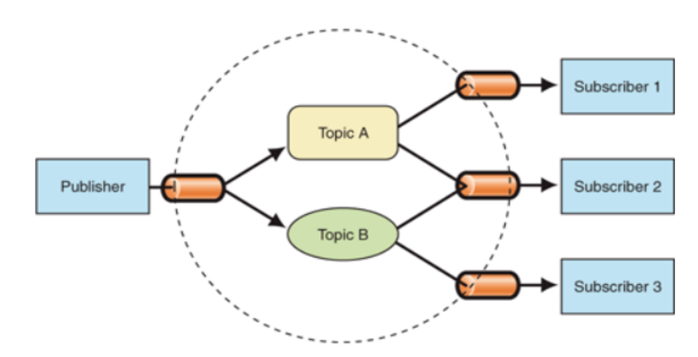

# Задания к уроку 22 от InnoDOM часть 1

## Лёгкий уровень

### [Задание 1](./task1.js)
Создайте функцию `mapAsync`, которая принимает массив и колбэк-функцию, а возвращает промис, который разрешается в новый массив, содержащий результаты асинхронных операций, выполненных с помощью переданного колбэка.

### [Задание 2](./task2.js)
Напишите функцию `forEachAsync`, которая принимает массив и колбэк-функцию. Функция должна вызывать переданный колбэк для каждого элемента массива асинхронно.

### [Задание 3](./task3.js)
Напишите функцию `getRandomBoolean`, которая возвращает промис, разрешающийся случайным булевым значением (true/false) через заданное количество миллисекунд. Используйте setTimeout для задержки разрешения промиса.

## Средний уровень

### [Задание 4](./task4.js)
Напишите функцию `parallel`, которая принимает массив функций-колбэков и вызывает их одновременно. Функция должна возвращать промис, который разрешается в массив результатов асинхронных операций, выполненных с помощью переданных колбэков.

### [Задание 5](./task5.js)
Напиши функцию `timeout`, которая принимает асинхронную функцию и время ожидания в миллисекундах. Если асинхронная функция не завершится в течение указанного времени, то функция `timeout` должна прервать выполнение и вернуть ошибку.

### [Задание 6](./task6.js)
Напиши функцию `checkPrimeNumber`, которая принимает число n возвращает промис, разрешающийся с булевым значением, указывающим, является ли число n простым числом. Используйте цикл и асинхронный await для проверки числа на простоту.

## Сложный уровень

### [Задание 7](./task7.js)
Реализуйте функцию eventEmitter, которая представляет собой простую реализацию паттерна "Издатель-Подписчик" (Publisher-Subscriber). Функция должна иметь методы subscribe, unsubscribe и publish. Подписчики должны быть оповещены о каждом событии, которое было опубликовано.

Подробнее о паттерне попробуйте найти самостоятельно (уметь гуглить хороший навык😉)